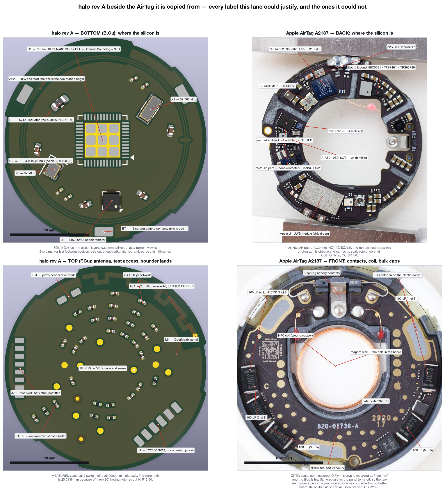

# halo vs the Apple AirTag — every row, side by side

*Generated 2026-09-05 from `spec/comparison.json` by `tools/gen_comparison.py`, at commit `38f10e4`. Nothing on this page is hand-typed: halo's parts, prices and stock come out of `spec/bom-resolved.json`, halo's board numbers out of `out/verify/dfm-jlc-4layer.json`, and Apple's side is transcribed from `research/01-airtag-hardware.md` with each confidence tag carried through rather than laundered into fact.*

> create comparisions between the real apple airtag and ours and show me eveyrthing. we must do a detailed pcb comparison and component comparison. first step is recreating it exactly.

**That last sentence is answered in section 4, and the answer is not the one the dossier's headline suggests.** The dossier says a clone can reproduce about 95 percent of the AirTag one-for-one. That is true *by function*. **By part number it is 33.3 percent.** 9 of the 18 lines in Apple's bill of materials have **no manufacturer part number in the public record at all**; one more — the ultra-wideband module everyone names as the wall — is identified and cannot be bought; and two more are named differently by two reputable teardowns. So the U1 is one of **10** lines that block an exact copy, and it is not the hardest of them: it is at least *known*.

## The counts

| | rows | SAME | EQUIVALENT | DIVERGED | MISSING | ADDED | CANNOT DETERMINE |
|---|--:|--:|--:|--:|--:|--:|--:|
| component comparison | 22 | 1 | 4 | 13 | 2 | 2 | 0 |
| PCB comparison | 12 | 3 | 1 | 5 | 0 | 0 | 3 |

**Verdicts mean exactly this:**

- **SAME** — the same part, or the same scheme built the same way. No design difference.
- **EQUIVALENT** — a different part doing the same job to the same specification. Chosen for sourcing, not for design reasons.
- **DIVERGED** — a deliberate design difference with a numbered decision behind it. Includes parts halo DELETED because their function moved somewhere else.
- **MISSING** — the function is absent from halo and nothing in halo replaces it.
- **ADDED** — halo has it and the AirTag does not. Counted separately; it is not a divergence from Apple, it is a departure from Apple.

## 1 · The component comparison

One row per function. Every line in the AirTag bill of materials is here, including the ones halo deleted.

| # | function | Apple's part | halo's part | verdict | decision · why |
|--:|---|---|---|---|---|
| 1 | **MCU + BLE radio + NFC tag — the brain** | **Nordic nRF52832-CIAA (nRF52832CIAAE)** *Apple ref U1, back side* *pkg:* WLCSP-50, 90 nm, 3.0 x 3.2 mm *marking:* N52832 CIAAE0 2102JK `primary` · research/01 §3 U1 — Catley, iFixit, TechInsights; marking read off oflynn-backside-fullres.jpeg | **U1 — NRF54L10-QFAA-R7 (NORDIC)** nRF54L10-QFAA-R7 · VFQFN-48 · LCSC C44800139 $2.4009 at 1 000 · 671 in stock | **DIVERGED** | **D12** — The nRF54L10 brings Bluetooth Channel Sounding, which ranges tag-to-tag at 6-10 cm without a second radio, and it costs 61 cents LESS than the nRF52832 it replaces. |
| 2 | **Ultra-wideband transceiver** | **Apple U1 (die TMKA75, TSMC 16 nm) in a USI SiP module** *Apple ref U2, back side* *pkg:* shield-can SiP, ~20.58 mm² die *marking:* none legible; Apple's own FCC internal photo 6 labels this position "UWB Module" `teardown` · research/01 §3 U2 — Catley (die marking via siliconpr0n), iFixit, TechInsights | **NOT FITTED. J2 reserves eight SMD lands just inboard of the board edge (VDD, GND, SPI SCK/MOSI/MISO) as a stuffing option — a stub, not a DW3110 land pattern, because no sourced DW3110 pin table exists in this repo.** | **DIVERGED** | **D1, D12** — There is no ultra-wideband transceiver you can buy a hundred of: DW3110 shows 30 in stock, DW3220 shows 9, and the DW1000/DW3210/DW3120/DWM3000 all show zero — so the ranging function moved into the SoC's own radio instead. |
| 3 | **Precision Finding — walk-up direction from an iPhone** | **Apple U1 + ANT3 + the 'Rose' coprocessor firmware, commanded over the 'Durian' L2CAP path**  *pkg:* — *marking:* — `teardown` · research/01 §4 and §8 — SEEMOO's opcode list; the U1 holds its own 64-bit processor and side-loads its firmware from the shared flash | **ABSENT. Nothing in halo does this and nothing can.** | **MISSING** | **D1, D5** — Precision Finding needs Apple's silicon AND Apple's blessing — the MFi programme's terms make the specification Apple Confidential, so reading it and publishing an implementation cannot both happen. |
| 4 | **Firmware storage — external non-volatile memory** | **GigaDevice GD25LE32D (iFixit) or GD25LQ32C/GD25LQ32DLIGR (O'Flynn) — 32 Mbit (4 MB) SPI NOR, 1.8 V** *Apple ref U3, back side* *pkg:* WLCSP-10 *marking:* none read; O'Flynn identified it from the 10-pad WLCSP pinout, J-Flash detected GD25LQ32C `primary, but the two teardowns name DIFFERENT part numbers` · research/01 §3 U3 — iFixit and O'Flynn disagree on the exact suffix | **DELETED. No external memory of any kind. Firmware lives in the nRF54L10's own 1.022 MB flash — measured at 13,164 bytes used, 1.27 percent.** | **DIVERGED** | **D18** — Apple needed 4 MB off-die because the U1's own 'Rose' firmware is staged there too; with no U1 and 1.27 percent of the SoC's internal flash used, an external NOR would be a part, a bus and a power gate carrying nothing. |
| 5 | **3-axis accelerometer — motion wake, anti-stalking detection** | **Bosch Sensortec BMA280 (iFixit writes "BMA28x")** *Apple ref U4, back side* *pkg:* metal-lid LGA, 2.0 x 2.0 x 0.95 mm *marking:* none legible in any photograph in images/airtag `teardown` · research/01 §3 U4 — Catley, iFixit, EDN | **U2 — LIS2DW12TR (ST)** LIS2DW12TR · LGA-12(2x2) · LCSC C189624 $0.7408 at 1 000 · 14,150 in stock | **EQUIVALENT** | Same job, chosen on one number: 50 nA in its lowest-power mode, which is what a coin cell budget turns on. |
| 6 | **Audio amplifier — drives the sounder** | **Maxim MAX98357A class-D digital audio amp (iFixit writes MAX98357B)** *Apple ref U5, back side* *pkg:* WLCSP *marking:* none legible in any photograph in images/airtag `teardown` · research/01 §3 U5 — Catley and iFixit, who name different suffixes | **DELETED. Two SoC GPIO driven anti-phase into the bender, through R9 (100 R series damping).** R9 100R — 0201WMF1000TEE (UNI-ROYAL) · 0201 · LCSC C270366 · $0.0016 at 1 000 · 262,500 in stock | **DIVERGED** | **D11a** — A bridge-tied class-D swings about 6 Vpp from a 3 V cell and two GPIO driven anti-phase swing the SAME 6 Vpp; what the amplifier bought was CURRENT, and a piezo bender is capacitive — 1.43 mA peak at 21 nF and 3.6 kHz, inside nRF54L high-drive. |
| 7 | **Main DC-DC buck — 3 V cell to the 1.8 V system rail** | **TI TPS62746, 300 mA step-down converter** *Apple ref U6, back side* *pkg:* small, metal-lid *marking:* 98C0051 / TPS746 — and this lane re-read it: the text is WHITE BOARD LEGEND alongside a silver metal-lid part, not a marking printed on the package. The identification stands; the description of where the text sits does not. `primary` · research/01 §3 U6 — Catley, iFixit; legend read off oflynn-backside-fullres.jpeg by this lane | **DELETED as a separate part. The nRF54L10's integrated DC-DC does the job with one external inductor, L1.** L1 4.7uH — MLZ1608M4R7WT000 (TDK) · 0603 · LCSC C76799 · $0.0420 at 1 000 · 18,790 in stock | **DIVERGED** | **D12** — The SoC that D12 chose has the converter on-die; keeping a separate buck would be paying for a second copy of something already inside U1. |
| 8 | **Op-amp — speaker feedback / analog conditioning** | **TI TLV9001IDPWR, 1 MHz rail-to-rail I/O op-amp** *Apple ref U7, back side* *pkg:* small SC-70 class *marking:* none legible in any photograph in images/airtag `teardown` · research/01 §3 U7 — Catley, iFixit | **DELETED. There is no analog audio path to condition: the drive is two digital pins.** | **DIVERGED** | **D11a** — The op-amp exists to serve a voice coil that halo does not have; with a bender driven straight off GPIO there is no analog node in the sounder path at all. |
| 9 | **Load switch / over-voltage protection — gates power to the UWB module and the flash** | **onsemi FPF2487** *Apple ref U8, back side* *pkg:* small *marking:* none legible in any photograph in images/airtag `teardown` · research/01 §3 U8 — iFixit | **DELETED. Nothing left to gate: the two loads it switched, the UWB module and the SPI flash, are both gone.** | **DIVERGED** | **D1, D18** — A power gate with no gated load is a part, a net and a leakage path for nothing. |
| 10 | **Secondary regulator / LDO — probably the flash's 1.8 V** | **UNIDENTIFIED. iFixit lists only "Likely onsemi DC-DC" and "Likely TI DC-DC".** *Apple ref U9, back side* *pkg:* SOT-23 class *marking:* 0561 / 1A8 / 1950 — read off oflynn-backside-fullres.jpeg by this lane, confirming the dossier `unverified — the dossier marks this row unverified and it stays unverified here` · research/01 §3 U9 | **DELETED with the flash it fed.** | **DIVERGED** | **D18** — It regulated a rail for a memory halo does not have. |
| 11 | **HF crystal — the radio reference** | **32 MHz crystal. MANUFACTURER AND PART NUMBER UNKNOWN.** *Apple ref X1, back side* *pkg:* 2-pad SMD *marking:* T320 / RBEV — read off oflynn-backside-fullres.jpeg by this lane `primary for the marking, none for the part number` · research/01 §3 X1 — Catley | **X2 — NX2016SA-32MHZ-STD-CZS-5 (NDK)** 32MHz · SMD2016-4P · LCSC C843260 $0.2333 at 1 000 · 12,675 in stock | **EQUIVALENT** | Same function, same frequency; halo's is specified at CL 8 pF ±10 ppm because that is what the SoC's datasheet asks for. |
| 12 | **LF crystal — the 32.768 kHz timing the key rotation depends on** | **32.768 kHz crystal. MANUFACTURER AND PART NUMBER UNKNOWN.** *Apple ref X2, back side* *pkg:* metal can, gold-rimmed, roughly 3.2 x 1.5 mm *marking:* A048L — read off oflynn-backside-fullres.jpeg by this lane `primary for the marking, none for the part number` · research/01 §3 X2 — Catley | **X1 — Q13FC13500004 (EPSON)** 32.768kHz · SMD3215-2P · LCSC C32346 $0.1026 at 1 000 · 656,850 in stock | **EQUIVALENT** | Same function; halo's Epson part is a JLCPCB Basic part so it carries no feeder fee. |
| 13 | **Bulk energy storage — hold-up through the battery-removal reset, and speaker transients** | **5 x 100 uF electrolytic/tantalum. NO PART NUMBER PUBLISHED.** *Apple ref C1–C5, front side* *pkg:* large SMD bricks around the front rim *marking:* J107S — read off oflynn-frontside-fullres.jpeg by this lane; all five located and counted `primary for the count and the marking, none for the part` · research/01 §3 C1–C5 — Catley, EDN | **C9, C10, C11, C12 — CL05A106MQ5NUNC (Samsung Electro-Mechanics)** 10uF · 0402 · LCSC C15525 $0.0193 at 1 000 · 5,940,100 in stock 4 x 10 uF 0402 = 40 uF, against Apple's 500 uF. One twelfth of the bulk. | **DIVERGED** | **D17, D22** — A 100 uF part is a brick and the top face inside Ø21.2 mm allows a 0.400 mm body, so Apple's rim capacitors do not physically fit under halo's diaphragm gap; halo's four sit on the BOTTOM face over the cell where 0.578 mm is allowed and they clear by 0.028 mm. |
| 14 | **Decoupling, matching and discrete passives** | **0201/0402 R, L, C including the antenna matching networks, plus K11-marked Schottky diode pairs mid-ring. NO VALUES PUBLISHED.**  *pkg:* 0201 and 0402 *marking:* K11 on the diode pairs; the passives carry none `primary for their existence, none for their values` · research/01 §3 — O'Flynn/Catley photographs | **SAME PACKAGE CLASSES, for the same reason Apple used them. The counts below are read off the resolved bill of materials, not asserted: 0201 dominates and the only 0402s are the four bulk capacitors on the bottom face, which is the one place the height allowance reaches 0.578 mm. The 2.4 GHz matching network is NORDIC'S reference values, not a copy of Apple's — Apple's values are published nowhere.** counted off spec/bom-resolved.json — BOM lines by package: 18 × 0201, 1 × 0402, 1 × 0603, 1 × QFN-48, 1 × LGA-12, 1 × SMD3215-2P, 1 × SMD2016-4P, 1 × bonded to shell, no land pattern, 1 × halo:HALO_BATT_CONTACT_3PAD placed parts by package: 33 × 0201, 4 × 0402, 1 × 0603, 1 × QFN-48, 1 × LGA-12, 1 × SMD3215-2P, 1 × SMD2016-4P, 1 × bonded to shell, no land pattern, 1 × halo:HALO_BATT_CONTACT_3PAD C18 1.5pF — GJM0335C1E1R5WB01D (muRata) · 0201 · LCSC C435397 · $0.0246 at 1 000 · 53,340 in stock L2 2.7nH — LQP03HQ2N7B02D (muRata) · 0201 · LCSC C7216765 · $0.0342 at 1 000 · 13,770 in stock C20 0.5pF — GJM0335C1HR50WB01D (muRata) · 0201 · LCSC C237424 · $0.0183 at 1 000 · 13,100 in stock | **EQUIVALENT** | **D22** — Same package classes for the same reason — height, not money: an 0201 body is 0.33 mm and fits the 0.400 mm allowance, an 0402 body is 0.55 mm and misses by 0.15 mm. |
| 15 | **2.4 GHz antenna** | **Inverted-F, LASER-DIRECT-STRUCTURED onto the plastic antenna carrier and soldered to pads at the board edge. Max gain -3.2 dBi.** *Apple ref ANT1, on the carrier, not on the board side* *pkg:* LDS trace on a moulded interconnect device *marking:* Apple's own FCC internal photo 6 labels the position "Bluetooth Antenna" `primary` · research/01 §3 ANT1 — Catley and Apple's FCC BLE test report E1V2 | **AE1 — a rim inverted-F ETCHED IN THE BOARD'S OWN COPPER on the Ø26.00 outline. No carrier, no solder joint. ce-rf models +0.521 dBi, 3.7 dB above Apple's published figure.** | **DIVERGED** | **D9, D16** — Etched copper is free, travels inside the KiCad design block, and cannot tear off — Apple's carrier antennas are attached by six solder joints that break when the board is lifted. |
| 16 | **13.56 MHz NFC antenna** | **LDS coil on the carrier with a return trace on the far side of the plastic and a via at each end. In the front photograph the central coil images as WOUND COPPER WIRE, not as a printed trace — this lane records that reading and does not resolve it against the dossier.** *Apple ref ANT2, front / carrier side* *pkg:* coil on the carrier, around the magnet well *marking:* Apple's FCC internal photo 5 labels the position "NFC Antenna" `primary for its existence and position; the winding technique is a CONFLICT between the dossier's LDS description and what this lane sees in the photograph` · research/01 §3 ANT2; oflynn-frontside-26mm-cropped.jpg read by this lane | **AE2 — a 2-turn coil ETCHED on the outer annulus, ce-rf measures 0.2449 uH, tuned by C24/C25.** C24, C25 1.1nF — no order code (CANNOT DETERMINE) | **DIVERGED** | **D9** — Same reason as the BLE antenna: copper on the board needs no carrier and no solder joint — and halo's annulus between the cell can and the contact lands is 0.70 mm wide, which holds two turns, not five, so the coil is eight times smaller than Nordic's reference and the tuning capacitors are eight times larger. |
| 17 | **6.5–8 GHz UWB antenna** | **Integral patch, LDS on the carrier. Gain -1.6 dBi at 6.5 GHz, -0.6 dBi at 8 GHz.** *Apple ref ANT3, on the carrier side* *pkg:* LDS trace on the carrier *marking:* Apple's FCC internal photo 6 labels the position "UWB Antenna" `primary` · research/01 §3 ANT3 — Catley and Apple's FCC UWB test report E2V3 | **ABSENT. No UWB radio, so no UWB antenna.** | **MISSING** | **D1, D12** — It feeds a transceiver that cannot be bought. |
| 18 | **The sounder** | **A copper VOICE COIL glued to the plastic dome, moving against a FIXED CENTRAL MAGNET — the whole housing is the diaphragm. Driven by the MAX98357A across TP1 and TP38. NOT A PART ANYONE SELLS.** *Apple ref SPK, centre front, through the board's central hole side* *pkg:* custom motor assembly: coil + rare-earth magnet + the shell *marking:* — `primary` · research/01 §5 — iFixit ("the AirTag's body is essentially a speaker driver"), Catley; iFixit measured 78-80 dB at about 13 cm | **LS1 — a BARE Ø20.0 x 0.21 mm piezo bender BONDED TO THE INSIDE OF THE SHELL, driven anti-phase from two GPIO. Same trick, catalogue part.** CEB-2021 — Same Sky (formerly CUI Devices) Ø20.0 × 0.21 mm, 3600 Hz (3100–4100), 21 nF, ≤300 Ω $0.369 at 1 000 · Digi-Key 3756 + Mouser 2202 in stock · not on LCSC | **DIVERGED** | **D11a, D20** — Apple's answer is not buyable and a housed buzzer is 3.5 mm tall against the ~1.5 mm available, so halo keeps Apple's IDEA — the housing is the radiating surface — with a part a fifth of a millimetre thick.  **INCONSISTENCY FOUND:** electronics/halo_rev_a/schematic.py still carries LS1 = Murata 7BB-20-3, the part D20 declares end-of-life with zero authorized stock beyond 38 pieces at TTI. spec/bom-resolved.json resolves the line to the Same Sky CEB-2021 and marks it RESOLVED BY REPLACEMENT. The schematic has not caught up. Lane C1 does not own electronics/ and reports this rather than fixing it. |
| 19 | **Power source and battery contacts** | **CR2032 3 V lithium coin cell (Panasonic in the FCC test unit), on THREE sprung metal contacts: one negative on the floor of the well, two positive tabs on the wall. BOTH positives must see 3 V to boot; the left one powers the electronics, the right one is sensed at about 50 nA. NO CONNECTORS ANYWHERE ON THE PRODUCT.** *Apple ref BATT, front / battery well side* *pkg:* stamped sprung contacts *marking:* — `primary` · research/01 §2.2 and §6 — FCC internal photo 4; Catley; O'Flynn | **BT1 — CR2032 on THREE sprung C5191 fingers on halo's own three-pad land pattern (no bought holder exists under 2 mm). Pad 1 VDD at 12 o'clock, pads 2 and 3 at 4 and 8 o'clock. The third pad is VBAT_SNS_HI through a 4.7 M / 4.7 M divider — 319 nA at 3 V against Apple's ~50 nA. No connectors on the board either.** R1, R2 4.7M — 0201WMF4704TEE (UNI-ROYAL) · 0201 · LCSC C778408 · $0.0015 at 1 000 · 10,100 in stock | **SAME** | Apple's scheme reproduced: three contacts, two rails, one of them sensed rather than loaded, and not a connector on the product. |
| 20 | **Debug access** | **Bare test pads. SWD fully exposed on TP30 (nRST) / TP35 (SWCLK) / TP36 (SWDIO) with SWO on TP31; the SPI flash fully exposed on TP19-TP24. APPROTECT is enabled but defeated by a voltage glitch on TP28. UNDOCUMENTED BY APPLE — the numbering is Colin O'Flynn's, not Apple's.** *Apple ref TP19–TP36, front side* *pkg:* bare copper pads *marking:* none — the names come from O'Flynn's map `primary` · research/01 §7.1 — O'Flynn's test-point map, the de-facto standard | **J1 — a Tag-Connect TC2030 SWD footprint with a PUBLISHED PINOUT, plus 11 named test points (TP1-TP11), including SEPARATE FORCE AND SENSE pads on VDD and GND so a microamp sleep measurement is a genuine four-wire one, and two ASYMMETRIC fiducials so a Ø26 mm circle has a datum at all.** | **DIVERGED** | **D6** — D6 point 3: certified tags from eufy and Motorola ship debug pads on the board but undocumented, and halo's differentiator is that ours is a header with a pinout. |
| 21 | **Google Find Hub broadcast** | **ABSENT. The AirTag broadcasts on Apple's network only.**  *pkg:* — *marking:* — `primary` · research/04 — no shipping product advertises both networks at once | **Both networks transmit in the SAME advertising event on all three channels. 2,888 bytes of flash and 116 of RAM. Written from Google's published specification byte for byte against its Tables 15 and 17.** | **ADDED** | **D7, D19** — Lane B found no open-source implementation of the Google network's tag side anywhere; halo appears to be the first. |
| 22 | **Peer-to-peer ranging between your own tags** | **ABSENT. The AirTag ranges to a PHONE, never to another AirTag.**  *pkg:* — *marking:* — `primary` · research/01 §4; research/08 | **Bluetooth Channel Sounding on the nRF54L10, specified at 6-20 cm line of sight and sub-metre in a real room on a 30 second update, with the accelerometer's orientation vector attached to every range. Tags report RAW RANGES with quality metadata, never solved positions.** | **ADDED** | **D12** — This is the capability Leif actually asked for, and Apple's Precision Finding does not provide it at any price. |

## 2 · The PCB comparison

| # | property | Apple | halo | verdict | decision · why |
|--:|---|---|---|---|---|
| 1 | **Bare board outer diameter** | ~26 mm `primary for the envelope, unverified for the exact figure` · research/01 §2 — Catley's 26 mm disassembled envelope; O'Flynn's own 26 mm circle drawn on frontside-26mm-cropped.jpg | **25.6138 x 26.0000 mm** *measured: out/verify/dfm-jlc-4layer.json → board_facts.size_mm* | **SAME** | 26.0000 mm on the major axis, inside Apple's stated ~26 mm. The minor axis is 25.6138 mm because three 26-degree keying notches cut to R12.60. |
| 2 | **Board thickness** | 0.30 mm `primary` · research/01 §2 — O'Flynn, verbatim: "it's 0.3mm PCB so I'm pretty sure I broke some solder joints getting it out" | **0.60 mm** *measured: out/verify/dfm-jlc-4layer.json → board_facts.thickness_mm* | **DIVERGED** | **D17** — TWICE Apple's, deliberately. D11a's piezo deletes Apple's magnet and voice coil, which returns 1.742 mm to the stack, and lane M spent part of it on a board that does not break when you handle it — the failure O'Flynn reports in the sentence above. |
| 3 | **Layer count** | NOT PUBLISHED. 4 is inferred from a 0.3 mm two-sided assembly with routed nets on both faces, and the dossier marks the inference UNVERIFIED. stacksmashing hosts merged layer pictures but states no count. `unverified` · research/01 §2 | **4 layers** *measured: out/verify/dfm-jlc-4layer.json → board_facts.copper_layers* | **CANNOT DETERMINE** | halo's 4 is measured; Apple's 4 is a guess nobody has confirmed. Two numbers that agree are not a match when one of them was never established — this row cannot be graded and is not graded. |
| 4 | **Board shape** | ANNULAR — a round board with a large central hole carrying the magnet and the voice coil. Visible in every teardown photograph. `primary` · research/01 §2 — iFixit, O'Flynn, FCC MLB photos | **SOLID DISC. No central hole. Three 26-degree keying notches cut to R12.60 on the rim.** *read off the Edge_Cuts geometry* | **DIVERGED** | **D11a, D17** — The hole exists to hold a magnet and a coil that halo deleted; with a bender bonded to the shell there is nothing to put in it, and the SoC sits in the middle instead. This is the divergence every other mechanical difference hangs off. |
| 5 | **Populated sides** | 2. Front: battery contacts, voice-coil pads TP1/TP38, magnet well, NFC coil, the five 100 uF caps, the test-point field. Back: every IC, both crystals, the UWB module. `primary` · research/01 §2 and §2.1 — O'Flynn's front/back photographs | **2. Bottom (B.Cu): the SoC, the accelerometer, both crystals, the four bulk capacitors, the DC-DC inductor, the NFC coil and the three battery contacts. Top (F.Cu): the passives, the 2.4 GHz antenna, the test points, the SWD footprint and the UWB stub.** *read off the .kicad_pcb footprint layers* | **SAME** | Same strategy — silicon on one face, interface on the other — with the faces assigned differently because halo's cell sits against the bottom, not the front. |
| 6 | **Connectors** | NONE, ANYWHERE. Every off-board connection is a spring contact or a soldered tab: 3 battery contacts, 6 antenna solder joints ("4x at upper center and 2x bottom left-of-center"), 2 voice-coil joints. `primary` · research/01 §2.2 — O'Flynn's tear-off joint count | **NONE either. Three sprung battery fingers, two piezo wire lands, and zero antenna joints because the antennas are etched in the board.** *read off the schematic's connector-less contract* | **SAME** | Same principle, and halo goes further: it has six fewer solder joints than Apple because the antennas are copper on the board rather than metal on a carrier. |
| 7 | **How the antennas attach** | THREE antennas LASER-DIRECT-STRUCTURED onto the plastic carrier and SOLDERED to pads at the board edge. NFC has an extra return trace on the far side of the plastic with a via at each end. The board is soldered to the plastic tray and the antenna joints TEAR if you lift it: "Removing the PCB is likely to cause damage due to the thin PCB and being soldered to the plastic tray." `primary` · research/01 §2 and §2.2 — Catley, O'Flynn | **TWO antennas ETCHED IN THE BOARD'S OWN COPPER. Zero solder joints, zero carrier, and the copper travels inside the KiCad design block so an integrator gets the routed antenna with the schematic.** *AE1 rim inverted-F on F.Cu; AE2 two-turn coil on B.Cu* | **DIVERGED** | **D9, D16** — TOGETHER WITH THE THICKNESS, THE DEEPEST DIVERGENCE IN THE PROJECT. Apple's scheme buys antenna volume outside the board at the cost of a tool, a plating line and six joints that break; halo's buys reproducibility and a distributable design block at the cost of antenna volume. D16 also names the limit: a design block carries no design rules, so halo's Ø37.31 mm keep-out has to travel as WORDS an integrator reads and applies — a block that places perfect copper into a host that floods ground over the antenna is worse than no block at all, because it looks correct. |
| 8 | **Test points** | About 38 numbered pads, reachable after popping the back cover without removing the PCB — but the numbering is Colin O'Flynn's, not Apple's, and Apple documents none of it. SWD on TP30/35/36 + SWO on 31; the SPI flash on TP19-24; the glitch pad on TP28. `primary` · research/01 §7.1 | **11 named test points with a published net and a stated reason each, plus a TC2030 SWD footprint and two asymmetric fiducials. TP1/TP2 are VDD force and sense, TP3/TP4 GND force and sense.** *read off the schematic's TESTPOINTS table* | **DIVERGED** | **D6** — Fewer pads, every one named and published. The force/sense pairs are the substantive difference: sleep current here is single-digit microamps and a two-wire measurement puts the probe's own contact resistance in series with the thing being measured. |
| 9 | **Board identity marking** | Silkscreen `820-01736-A` on the front, `920-08283-01` on the NFC-antenna side, plus a manufacturing data code (`2920 17` = week 29 of 2020, batch 17) and a lone `C`. Regional codes: US 2920/3020/3120, EU 5220, Asia 1021. `primary` · research/01 §2 — Catley; all three read off oflynn-frontside-26mm-cropped.jpg by this lane | **M1 — a DataMatrix serial mark on the probed face.** *read off the board's footprint list* | **EQUIVALENT** | Both carry a board identity and a per-unit trace; Apple's is human-readable silkscreen, halo's is machine-readable. |
| 10 | **Controlled impedance on the RF feed** | NOT PUBLISHED. No teardown states a stackup, a dielectric height or a trace width. `unverified` · research/01 §2 — the layer count itself is unpublished | **0.127 mm trace, computed 51.93 Ω (Hammerstad-Jensen) / 50.26 Ω (IPC-2141) on PCBWay build #35, about 49-50 Ω under solder mask. At JLCPCB the impedance is UNCONTROLLED at 0.60 mm and the number to hand the factory is a RANGE, 47-66 Ω.** *D21, two independent closed forms 1.7 Ω apart* | **CANNOT DETERMINE** | **D21** — Apple's side of this row does not exist in public, so there is nothing to compare against. halo's own number is stated with its class of accuracy: a closed form of the ±10 percent class, not a 2D field solve and not a TDR. |
| 11 | **Copper content** | NOT PUBLISHED. TechInsights states only that the radio ICs occupy "less than 30 mm², or 6%, of the entire available PCB area". `secondary` · research/01 §11 | **62 footprints · 49 vias · 255 track segments** *measured: out/verify/dfm-jlc-4layer.json → board_facts* | **CANNOT DETERMINE** | halo's counts are measured; Apple publishes one derived percentage and no counts. Not comparable. |
| 12 | **Board-to-enclosure attachment** | SOLDERED TO THE PLASTIC TRAY. Destructive to remove. `primary` · research/01 §2 — Catley | **Not soldered to anything. The board drops into the carrier; the piezo bonds to the SHELL, not to the carrier, because the shell is the diaphragm.** *D17* | **DIVERGED** | **D17** — A serviceable board and a repairable product, against an assembly that cannot be taken apart without breaking the antenna joints. |

## 3 · Side by side, labelled

SCALE, stated rather than assumed. The two LEFT-HAND halo panels and the Apple FRONT panel are all cropped to the same 26 mm square and rendered at the same pixel size, 36.9 px/mm, so a millimetre is a millimetre across them — but the two scales are not the same KIND of number. halo's is MEASURED: 26.0000 mm on the major axis, read off the Edge_Cuts geometry of its own board file. Apple's is CITED: O'Flynn named his crop `frontside-26mm-cropped` and images/airtag/CATALOG.md records it as "cropped to the ~26 mm PCB diameter". The tilde is his and it is carried through — a circle least-squares fitted to the outermost feature in that frame comes out at 825 px across, which on the cited scale is 27.22 mm, consistent with a plastic carrier ring around a 26 mm board but not a confirmation of it. So: the two boards are the same diameter to the precision anyone has published, and no tighter comparison is available from any source in this repo. Apple's BACK photograph has NO scale reference of any kind — it is oblique, and a circular board images 2 460 x 2 760 px in it, an 11 percent difference between the axes. It is shown to fit, and no scale bar is drawn on it.

### What this lane can actually find in Apple's photographs

What this lane can find with its own eyes in the photographs in images/airtag, and what it cannot. LOCATED means a marking was read or Apple's own FCC exhibit labels that position. CANNOT LOCATE means the part is in the dossier's bill of materials and this lane cannot point at it in any photograph in the repo. No part is called located on the strength of the dossier alone.

| part | verdict | evidence |
|---|---|---|
| nRF52832 | **LOCATED** | marking `N52832 CIAAE0 2102JK` read directly off oflynn-backside-fullres.jpeg at approximately (1210, 795) px |
| 32 MHz crystal | **LOCATED** | marking `T320 / RBEV` read at (940, 1055) px — but the marking resolves to no manufacturer part number |
| 32.768 kHz crystal | **LOCATED** | marking `A048L`, rotated 180°, read at (1128, 590) px — same caveat, no part number |
| TPS62746 buck | **LOCATED WITH A CORRECTION** | the text `98C0051` / `TPS746` at (2090, 910) px is WHITE BOARD LEGEND beside a silver metal-lid part at (1900, 845) px, not a marking printed on a package. The identification stands; the dossier's description of it as a package marking does not. |
| Apple U1 UWB module | **LOCATED** | the large shield can at (1170, 2640) px, whose position matches the "UWB Module" label on Apple's own FCC internal photo 6 |
| the `1A8` / `1950` SOT (dossier U9) | **LOCATED BUT UNIDENTIFIED** | markings `0561`, `1A8`, `1950` read at (655, 1700) px. The dossier marks this row UNVERIFIED and it stays unverified — a marking is not a part number. |
| the `6X A75` part | **LOCATED BUT UNIDENTIFIED** | blue package, marking `6X A75` read at (792, 1465) px. The dossier calls it a tantalum capacitor; nothing in the repo confirms that. |
| five 100 uF bulk capacitors | **LOCATED — ALL FIVE** | five `J107S`-marked bricks counted around the front rim of oflynn-frontside-26mm-cropped.jpg. The count matches the dossier exactly. `J107S` is a marking, not an order code. |
| NFC coil | **LOCATED, WITH A CONFLICT** | wound copper is plainly visible around the magnet well in the front photograph. The dossier describes ANT2 as an LDS trace on the carrier. This lane reports both readings and resolves neither. |
| battery contacts | **LOCATED** | the sprung metal assembly at 12 o'clock on the front photograph; FCC internal photo 4 shows the same three contacts from the battery-well side |
| board part number and data code | **LOCATED** | `820-01736-A`, `2920 17` and a lone `C` all read directly off oflynn-frontside-26mm-cropped.jpg |
| LDS antenna segments on the carrier | **LOCATED BY APPLE'S OWN LABEL** | grey metallised patches on the plastic carrier in the front photograph; Apple's FCC internal photo 6 names four of these positions Bluetooth Antenna, Bluetooth Module, UWB Module and UWB Antenna. Which patch is which is Apple's claim, not this lane's measurement. |
| GD25 SPI NOR flash (U3) | **CANNOT LOCATE** | a WLCSP-10 with no legible marking. Nothing in any photograph in images/airtag distinguishes it from the other unmarked small packages. |
| MAX98357A audio amplifier (U5) | **CANNOT LOCATE** | WLCSP, no legible marking, no third-party annotation in the repo places it |
| TLV9001 op-amp (U7) | **CANNOT LOCATE** | no legible marking |
| FPF2487 load switch (U8) | **CANNOT LOCATE** | no legible marking |
| BMA280 accelerometer (U4) | **CANNOT LOCATE — TWO CANDIDATES** | there are two unmarked metal-lid parts on the back side, at (1900, 845) px and (522, 1670) px. The dossier says one of them is the accelerometer. This lane cannot say which and does not guess. |
| the large unmarked black IC on the back side | **PRESENT, UNIDENTIFIED** | a moulded package with no marking at all, sitting between the two metal-lid parts at (572, 1417) px. It images at roughly 3 mm on a side, but that is an ESTIMATE off a photograph with no scale reference and an oblique view, not a measurement. It is the largest unidentified part on the board and the dossier does not account for it by name. |
| matching networks and discrete passives | **CANNOT IDENTIFY** | visible as 0201/0402 bodies throughout; no values are published by anyone and none can be read from a photograph |

**12 of 19 located, 6 cannot be located.** The four ICs that cannot be found — the flash, the amplifier, the op-amp and the load switch — are exactly the four halo deleted, so nobody has ever pointed at them in a photograph either. Their identification rests entirely on iFixit and Catley having had the physical part.

## 4 · What recreating it exactly would take

Leif asked for this directly. Each DIVERGED and MISSING row below is ranked on one question — what would it cost to match Apple instead?

### Impossible — the part cannot be bought, or cannot be identified — 4 rows

| # | function | buyable? | what it costs the stack | money | schedule | what matching Apple would LOSE |
|--:|---|---|---|---|---|---|
| 2 | **Ultra-wideband transceiver** | NO, AT ANY PRICE. The U1 is Apple-custom silicon in a USI system-in-package and is not sold to anyone. There is no drop-in and no grey channel for it. This is the single hard wall in the whole project. | n/a | n/a — not a money question. | n/a. | Nothing halo has. The nearest CATEGORY substitute is a Qorvo/NXP DW3xxx, which D12 priced at +$8.86 per tag and which is neither pin-, protocol- nor Find-My-compatible; its driver licence also carries a Qorvo-silicon-only field-of-use clause that cannot sit inside AGPL firmware. |
| 3 | **Precision Finding — walk-up direction from an iPhone** | NO. Two independent walls: the U1 is not sold, and the certified path additionally needs a per-unit Apple Token burned at an MFi factory. | n/a | n/a. | n/a. | — |
| 10 | **Secondary regulator / LDO — probably the flash's 1.8 V** | CANNOT BE ORDERED — nobody has identified the part. "1A8" and "1950" are a marking code and a date code, not an order code, and no public teardown resolves them. An exact recreation would have to reverse-engineer the function from the net it sits on. | n/a until it is identified. | CANNOT DETERMINE. | Package decapsulation or a marking-code database this repo does not have. | Nothing. |
| 17 | **6.5–8 GHz UWB antenna** | Pointless without row 2, which is impossible. | n/a | n/a. | n/a. | — |

### Expensive — buyable in principle, and it would cost the stack, the tooling or both — 4 rows

| # | function | buyable? | what it costs the stack | money | schedule | what matching Apple would LOSE |
|--:|---|---|---|---|---|---|
| 13 | **Bulk energy storage — hold-up through the battery-removal reset, and speaker transients** | The VALUE is buyable; the PART is not identified — "J107S" is a marking, not an order code, and no teardown names the manufacturer. | THIS IS THE BLOCKING ONE. No 100 uF capacitor exists at the 0.33 mm body height that D22 measured as the ceiling on the top face, and Apple mounts its five on the FRONT rim of an annular board that halo does not have. Fitting them means the annular outline (row PCB-4) and the carrier come back too. | CANNOT DETERMINE for the part. The stack cost is the whole of D17's 1.742 mm recovery. | A full mechanical re-budget, not a BOM change. | Whether 40 uF holds halo up long enough for a five-removals reset is NOT MEASURED here — the VBAT_SNS net and TP7 exist for exactly that test and the test has not been run. CANNOT DETERMINE. |
| 15 | **2.4 GHz antenna** | The GEOMETRY is not published — no teardown traces the LDS pattern. And LDS is a PROCESS, not a part: it needs a moulded thermoplastic carrier doped with an LDS additive, a laser-structuring pass and an electroless plating line. | It brings the plastic carrier back, and with it the soldered board-to-carrier joints, and D17's flat-inside shell would have to become Apple's carrier-plus-shell pair. | CANNOT DETERMINE — no LDS quote was retrieved by this lane or by any other in this repo. For scale, D13 prices a single-cavity aluminium tool for ONE plain moulding at $1,500-3,000 and two-shot tooling at $45,000-95,000; an LDS carrier needs its own tool plus the structuring and plating steps on top. | Tooling lead time plus a process qualification, against etched copper which ships on the same panel as the board. | 3.7 dB of modelled gain, by Apple's own published number against ce-rf's. |
| 16 | **13.56 MHz NFC antenna** | Geometry not published. Same LDS process problem as row 15 — or, if the photograph is right and it is wound wire, a hand-wound coil and a bonding step. | Brings back the carrier and the central magnet well the coil is wound around. | CANNOT DETERMINE. | As row 15. | Nothing measured. halo's coil inductance is modelled, Apple's is one of lane G's six open bench measurements and has never been measured by anyone in public. |
| 18 | **The sounder** | NO. There is no order code for Apple's motor. You would specify a coil (wire gauge, turns, former, bond), source a rare-earth magnet and a magnet well, and qualify a glue bond to a moulded dome — a custom assembly with its own tooling and its own line step. | It brings back the central magnet and the coil that D17 DELETED — the two parts whose removal freed the 1.742 mm halo spent on the 0.60 mm board and the 0.680 mm diaphragm gap. It also re-opens the annular board outline, because the magnet needs the hole. | CANNOT DETERMINE for the assembly. For scale, D11 priced the alternative — a real micro-speaker — at about $5.45, which is more than the rest of halo's board; halo's bender is $0.369 at a thousand. | The longest single item in this table: a custom electro-acoustic part, its tooling, and an acoustic qualification. | It would ADD about 3.2 g — D17 measures halo at 7.8 g against the AirTag's 11 g and names Apple's motor as the whole difference. And iFixit found the piezo rivals were "just as much, if not more, noise": Apple chose the coil for sound QUALITY, not for volume, and halo is not selling sound quality. |

### Cheap — the part is on a shelf and we chose otherwise, for reasons that are yours to overrule — 7 rows

| # | function | buyable? | what it costs the stack | money | schedule | what matching Apple would LOSE |
|--:|---|---|---|---|---|---|
| 1 | **MCU + BLE radio + NFC tag — the brain** | Yes. nRF52832-CIAA is a live catalogue part; D12 priced it at $2.81 at a hundred. | WLCSP-50 is 3.0 x 3.2 mm against the QFN-48's 5.0 x 5.0 mm, so it FREES board area — but a WLCSP at 0.35 mm pitch needs finer design rules than this 0.127 mm / 0.09 mm board is quoted at, and the escape would have to be re-solved. | +$0.61 per unit at a hundred (D12's own figures: $2.81 for the nRF52832 against $2.20/$2.59 for the nRF54L05/L10). | A full re-layout of the SoC block and a firmware port back to nRF52 — which is the direction every existing Find My implementation already runs, so the firmware half gets EASIER, not harder. | Channel Sounding, and with it peer-to-peer ranging between Leif's own devices — the one capability D1 says no consumer tag offers at all. |
| 4 | **Firmware storage — external non-volatile memory** | The FAMILY is catalogue and costs cents. The exact part is NOT settled: iFixit says GD25LE32D, O'Flynn says GD25LQ32C, and those are different order codes. An exact recreation cannot choose between them from the public record. | A WLCSP-10 is small, but every square millimetre of the top face inside Ø21.2 mm has only 0.400 mm of clearance under the piezo diaphragm, and the bottom face is over the cell. Four SPI nets plus a gated 1.8 V rail would have to be routed on a board already carrying 255 track segments and 49 vias. | Cents for the part; this lane did not fetch a price and does not invent one. | A schematic block, a re-layout of the SoC's south side, and a firmware driver for a memory holding 1.27 percent of what already fits on-die. | Nothing. It would be dead weight. |
| 6 | **Audio amplifier — drives the sounder** | The family is catalogue. WHICH PART is not settled — Catley says MAX98357A, iFixit says MAX98357B. | A WLCSP plus its bypass on a top face with 0.400 mm of clearance, or a bottom face already carrying the SoC, both crystals, the accelerometer, the inductor and four bulk capacitors. | Not fetched; not invented. | A schematic block, an I²S link the firmware does not have, and a re-layout. | Nothing, and it would make the sounder WORSE: the amplifier was the right part for Apple's 8 Ω voice coil and is the wrong part for a capacitive bender. Restoring it only makes sense together with row 13, the voice coil. |
| 7 | **Main DC-DC buck — 3 V cell to the 1.8 V system rail** | Yes — TPS62746 is a live TI catalogue part. No price fetched by this lane. | One more IC plus its own inductor and output capacitance on a 62-footprint Ø26 mm board. | Not fetched. The part it replaces, L1 (TDK MLZ1608M4R7WT000), is $0.042 at a thousand — so this is a strict addition, not a swap. | A power-tree redesign: the SoC would have to be run from an external rail instead of its own converter. | Nothing. It is pure duplication. |
| 8 | **Op-amp — speaker feedback / analog conditioning** | Yes, catalogue, cents. No price fetched by this lane. | One more small package on a full board. | Not fetched. | Conditional on rows 6 and 13 — it has nothing to do until the amplifier and the coil come back. | Nothing. |
| 9 | **Load switch / over-voltage protection — gates power to the UWB module and the flash** | Yes, catalogue. No price fetched. | One more package. | Not fetched. | Conditional on rows 2 and 4 returning first. | Nothing. |
| 20 | **Debug access** | Bare pads cost nothing. Reproducing APPLE'S map exactly would mean matching a 38-pad numbering scheme invented by a third party for a board layout halo does not share. | Free. | $0. It is a documentation choice, not a part choice. | n/a. | The four-wire force/sense pairs, which exist because a two-wire measurement puts the probe's own contact resistance in series with a single-digit-microamp reading. |

### The honest ceiling: can you order an AirTag's bill of materials?

The AirTag bill of materials as the dossier lists it in §3, graded on ONE question: could you place an order for this exact line? This is the table that answers 'first step is recreating it exactly'.

| line | can you order it? | why |
|---|---|---|
| U1 — nRF52832-CIAA | **ORDERABLE** | full part number published and confirmed by three independent teardowns |
| U2 — Apple U1 UWB module | **IDENTIFIED BUT UNBUYABLE** | Apple-custom die in a USI SiP, not sold to anyone at any price |
| U3 — GD25 32 Mbit SPI NOR | **AMBIGUOUS** | iFixit says GD25LE32D, O'Flynn says GD25LQ32C — different order codes, and the public record does not choose |
| U4 — Bosch BMA280 | **ORDERABLE** | part number published; iFixit hedges to 'BMA28x' but Catley and EDN name the BMA280 |
| U5 — Maxim MAX98357A | **AMBIGUOUS** | Catley says MAX98357A, iFixit says MAX98357B |
| U6 — TI TPS62746 | **ORDERABLE** | board legend TPS746 read directly, and two teardowns agree |
| U7 — TI TLV9001IDPWR | **ORDERABLE** | full order code published by Catley |
| U8 — onsemi FPF2487 | **ORDERABLE** | named by iFixit |
| U9 — '1A8' / '1950' SOT | **UNIDENTIFIED** | no teardown resolves the marking; iFixit says only 'likely a DC-DC' |
| X1 — 32 MHz crystal | **UNIDENTIFIED** | 'T320 / RBEV' is a marking, not an order code |
| X2 — 32.768 kHz crystal | **UNIDENTIFIED** | 'A048L' is a marking, not an order code |
| C1-C5 — 5 x 100 uF | **UNIDENTIFIED** | 'J107S' is a marking; the value is known, the part is not |
| passives — 0201/0402 R, L, C and the matching networks | **UNIDENTIFIED** | no values are published by anybody; nothing can be read off a photograph |
| ANT1 — BLE inverted-F, LDS on carrier | **UNIDENTIFIED** | geometry not published; only the -3.2 dBi gain is, in Apple's own FCC report |
| ANT2 — NFC coil on carrier | **UNIDENTIFIED** | geometry not published; inductance never measured by anyone in public |
| ANT3 — UWB patch, LDS on carrier | **UNIDENTIFIED** | geometry not published; only the -1.6/-0.6 dBi gains are |
| SPK — voice coil + magnet + shell | **NOT A PART** | a custom motor assembly with no order code anywhere; D11a: 'not a part anyone sells' |
| BATT — CR2032 | **ORDERABLE** | a commodity cell; the FCC test unit's was a Panasonic |

**6 of 18 lines are orderable today (33.3 percent).** Allow the two lines where two reputable teardowns name different part numbers and it is 8 of 18 (44.4 percent). **1 line is identified and cannot be bought at any price** — the Apple U1. **9 lines have no public part number at all**: an exact recreation would have to measure them off a physical AirTag.

**So the two numbers, both true, measuring different things:**

| question | answer |
|---|--:|
| Could a clone reproduce the AirTag's FUNCTIONS from catalogue parts? | **94.4 %** of lines (17 of 18) — everything but the U1 |
| Could you place an ORDER for the AirTag's actual bill of materials? | **33.3 %** of lines (6 of 18) |

### The residual, named

- The Apple U1 ultra-wideband module, and with it Precision Finding. Not sold, at any price, to anyone. This is the wall the dossier names and nothing in this comparison moves it.
- Appearing in the stock Find My app. Needs a per-unit Apple Token burned at an MFi factory, and D5 records why halo cannot take that route: reading the MFi specification and publishing an implementation cannot both happen.
- Nine of the eighteen bill-of-materials lines have NO PUBLIC PART NUMBER. That is the real ceiling on 'recreating it exactly', and it is higher than the U1 wall.

*Regenerate with `python3 tools/gen_comparison.py`. Counts in `out/comparison/comparison-summary.json`.*
